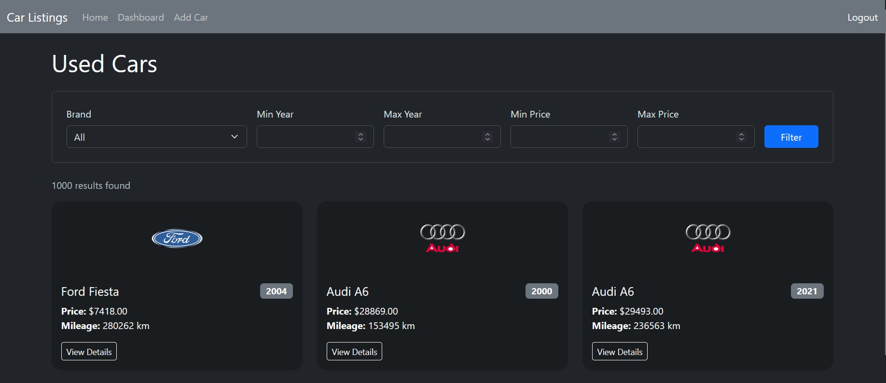
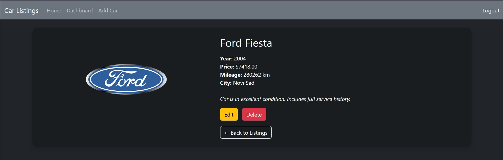
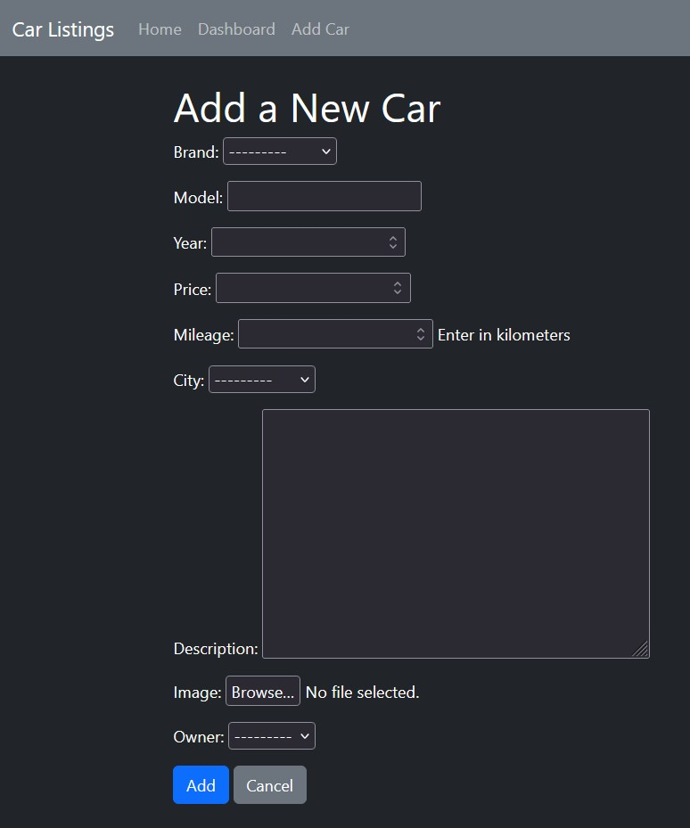
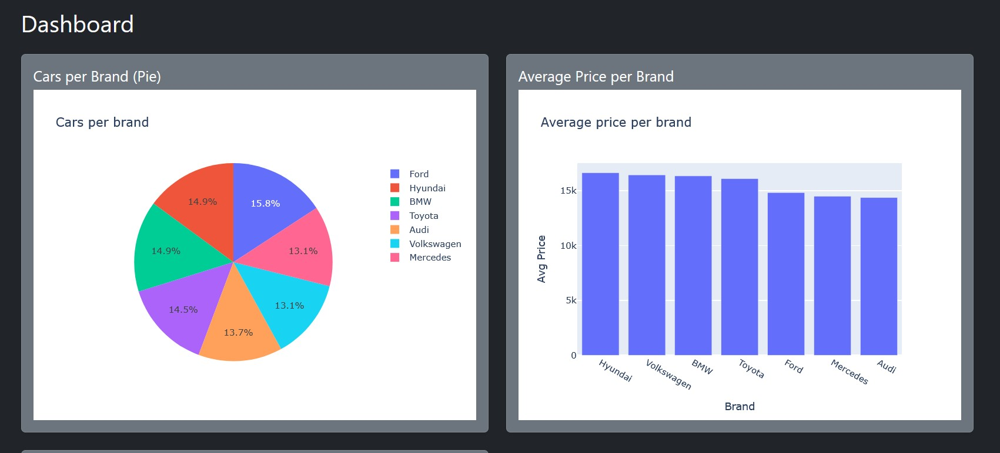

# Used Car Listings Django Web Application

## Live Demo

**[Used Cars Django App — Deployed on Render](https://used-cars-django-app.onrender.com/)**

### This is a full-featured Django web application for managing used car listings. It's features are:

- Browse and filter car listings by brand, price, year, and other criteria
- Add, edit, and delete car entries with user authentication and ownership control
- View detailed information about each car listing
- Register and log in securely to manage personal listings
- Access an interactive dashboard with charts and summary statistics using Plotly
- Navigate a clean and simple user interface optimized for both desktop and mobile
- Experience form validation and error handling for data input

### Technologies Used

- **Python 3.10.6** 
- **Django 5.2.3** 
- **SQLite / PostgreSQL** — (SQLite by default, PostgreSQL optional)  
- **Django ORM** 
- **HTML5 / CSS3 / Bootstrap**
- **Plotly.js 6.2.0** 
- **Git & GitHub** 
- **pip & virtualenv (.venv)** 
- **Django Authentication System** — user registration, login, and permission management  
- **Django Forms** — for data input, validation and CRUD operations  
- **Django Templates** — for dynamic HTML rendering  
- **PyCharm** 

### Key Features

#### Browse & Filter Listings  

#### Car Detail View  

#### Add/Edit Car Form  

#### Interactive Dashboard  

